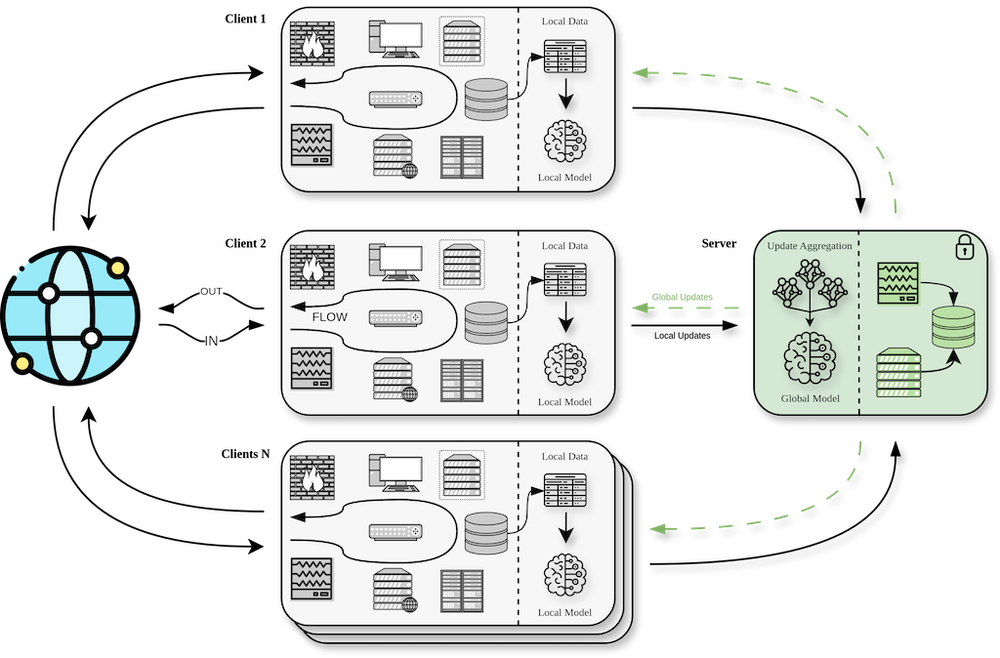

# Secure Federated Learning for Multi-Party Network Monitoring
This repository contains the source code for the corresponding paper.



## Structure
```
├── config
│   └── config.py
├── data
│   ├── dataset.py
│   └── partition_functions.py
├── federation
│   ├── client
│   └── server
├── ml_metrics
│   └── mods_utils.py
├── saves
├── run.sh
├── client_app.py
├── server_app.py
├── README.md
└── visualization.ipynb
```


## Prerequisites
- Python 3.11
- Local `flower` from [forked repo](https://github.com/letv3/flower)
- Shell (Bash, zsh, Fish)

## Installation
1. Install `flower` from local directory 
```
    pip install -e path/to/local/flower
```
2. Install requirements
```
    pip install -r req311.txt
```

## Usage
__TL;DR__
```
$ ./run.sh
```

Entry point for whole program is `run.sh` script, where the following parameters can be changed:
- Number of Participants   - $n \in R$
- Partition Type           - {noniid, iid, vertical}
- Aggregation Type         - {regular, secure}

Additional configuration changes can be made in `config.config.ExpConfig` object.

## Results and Visualization
Each execution yields several files in `./saves` directory with the same file name starting (indicating run parameters and timestamp).

__Saved artifacts include__:
- Global Training History - `history.pkl`
- Final Model Weights - `weights.h5`
- Clients convergence metrics - `lclmetrics.csv`

These artifacts are used for visualizaiton in `visualization.ipynb`


## Abstract
```
Network monitoring is essential for IT infrastructure health, enabling proactive threat detection,
bandwidth optimization, and data analysis. Federated Learning facilitates collaboration and
expands threat detection capabilities by allowing multiple clients to train models
while preserving privacy and security without compromising sensitive information.
This work explores the application of Federated Learning for secure network monitoring
by investigating its use in various data partitioning settings to train Deep Learning models
across multiple data partitions, incorporating secure aggregation to enhance data privacy.
We propose an approach for multiparty training of deep neural networks
for time series-based network load forecasting with secure aggregation.
Our approach shows that a collaboratively trained model, on horizontal partitions,
performs 11%-14% better than model training only on a single
partition of that type. The model trained on vertical partitions
achieved performance comparable to that of the models trained
on a complete data set. Finally, examining the proposed approach
on horizontal and vertical partitions proved its viability in both
aggregation settings, regular and secure. These contributions
demonstrate the feasibility of Federated Learning to improve
interoperability between multiple organizations while addressing
privacy and security concerns.
```

## Citation

```
@article{lytvyn2023secfl,
  title={Secure Federated Learning for Multi-Party Network Monitoring},
  author={Lytvyn, Oleksandr and Nguyen, Giang},
  journal={},
  volume={},
  pages={},
  year={},
  publisher={},
  doi={}
}
```

## Credits
The authors thank S.D., V.T. and Á.L.G. for knowledge sharing and support.
Also, we'd like to mention the developers of Flower framework - [adap/flower](https://github.com/adap/flower).
